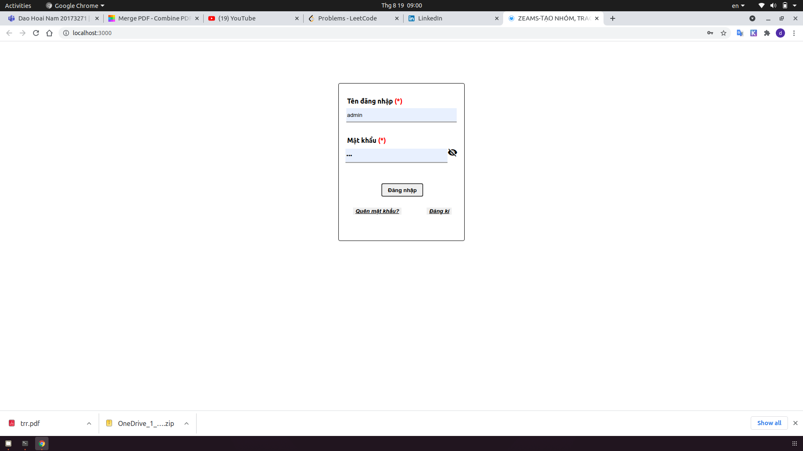
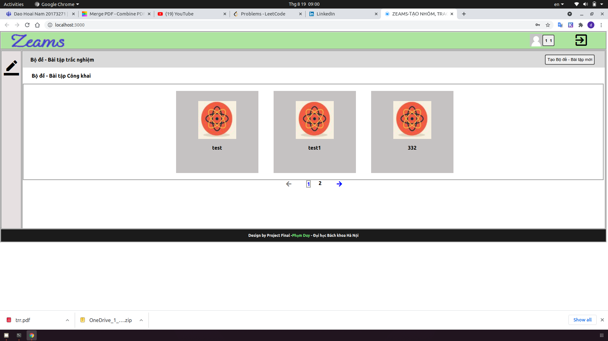
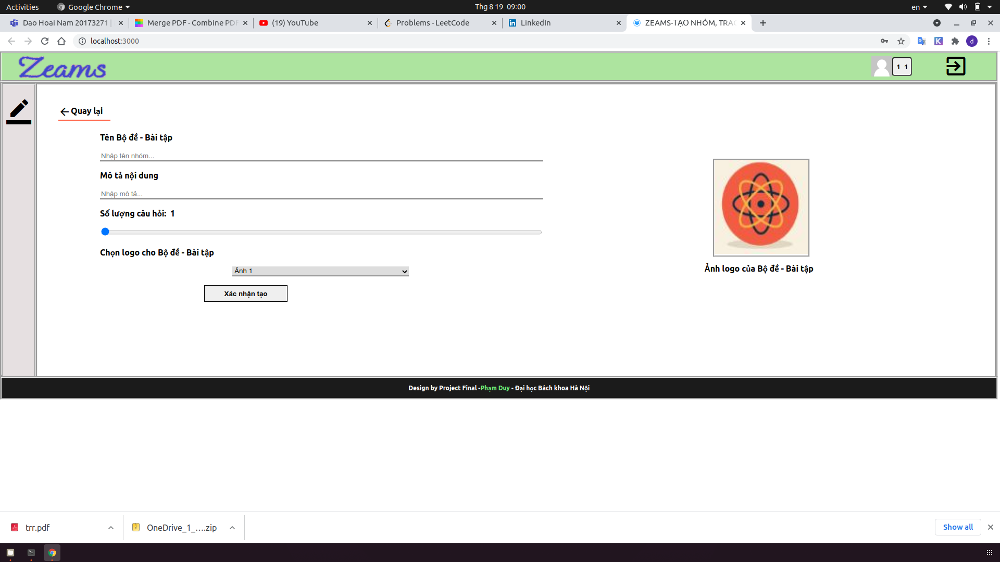
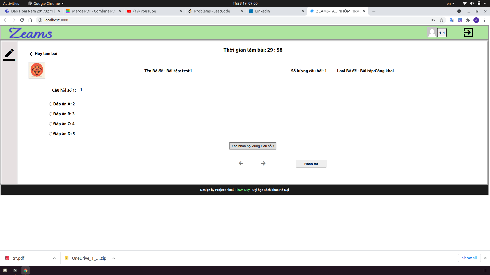
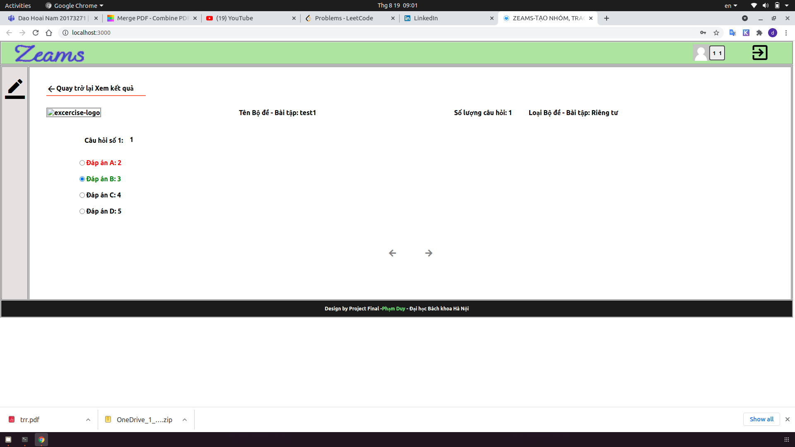

# NH-M-C-NG-NGH-WEB
Project Design Web

Server: using golang, mongo-db

Client: using ReactJS

<H1>Setup:</H1>
<H2>Requierment: </H2>

- MongoDB
- Golang version >=1.12
- ReactJS: npm version >= 6.0.0

<h2>Backend: </h2>

Frist, install golang evn using command:
- `cd Backend/`
- `go mod init web `
- `go mod vendor`

Then start mongodb at port 27017. And run server:
- `go run -mod=vendor main.go`

<h2>FrontEnd: </h2>
Install npm env:
- `cd FRONTEND`
- `npm install`

Run client:
- `npm start`

<h2>Some web screen:</h2>

